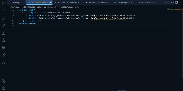
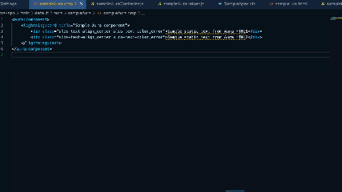

# SFDX Labelizer for visual studio code

This extension enables Visual Studio Code to easily generate custom labels from static text in an sfdx project.

## Features
This extension provides easy way to detect and fix and static text referenced in a sfdx project for following metadata:
    1. LWC component
    2. Aura Component
    3. Apex classes
* Auto scan and detect static texts in a file.
* Provide quick fix option "Convert to label" to automatically generate a custom label and replace existing text with label.
* Provide quick fix option "Add to ignore list"
* Select any static text in your vs code extension and "Convert to label" to automatically generate a custom label and replace existing text with label.

  
  

## Extension Settings
This extension contributes the following settings:

* `Labelizer: Enable Scan`: "Auto scan files for static texts"
* `Labelizer: Ignore List`: "List of glob patterns to be ignored"
* `Labelizer: Label Path`: "Path to custom label file"